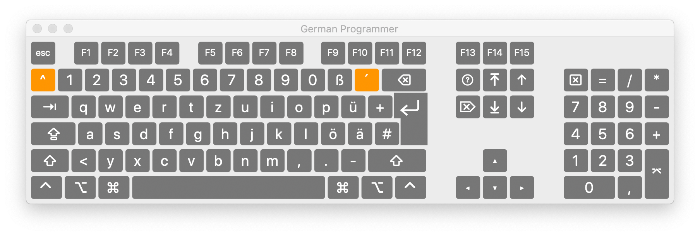
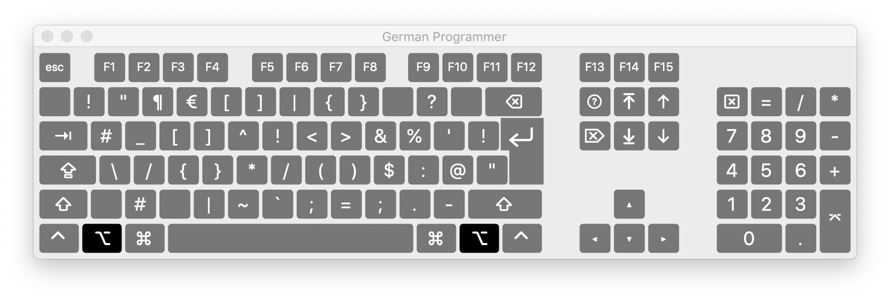

# programmer-keyboard-layouts
My custom german keyboard layout for programming

Level 1 Layout (basic german layout)


Level 3 Layout (inspired by Neo layout)


# Windows tweaks for Capslock

## Using AutoHotkey
Use this AutoHotkey snippet to change Capslock to AltGr (R-Alt):

```
*$Capslock:RAlt 
```

## Alternative: Patching MKLC kbd.h

Microsoft Keyboard Layout Creator 1.4 comes with a full C compiler and compiles your `.klc` files to a DLL. Luckily we also have the sources at hand and can change them to our
liking!

To change Capslock to RAlt do the following:

Open `C:/Program Files(x86)/Microsoft Keyboard Layout Creator 1.4/inc/kbd.h`

Look for:

```C
#define T3A _EQ(                           CAPITAL                      )
```

Change to:
```C
#define T3A _EQ(                           RMENU                      )
```

Save and run MKLC, open your `.klc` file and generate the DLL and installers. If you
have errors or have previously installed a keyboard map you have to remove them via 
"Add Remove Programs" (yeah what a joke) and then generate the installers. When you are
finished, run the appropriate installer (it's somewhere in your Documents folder) and accept the security warning. Oh, and you have to reboot because nothing is easy in Windows.